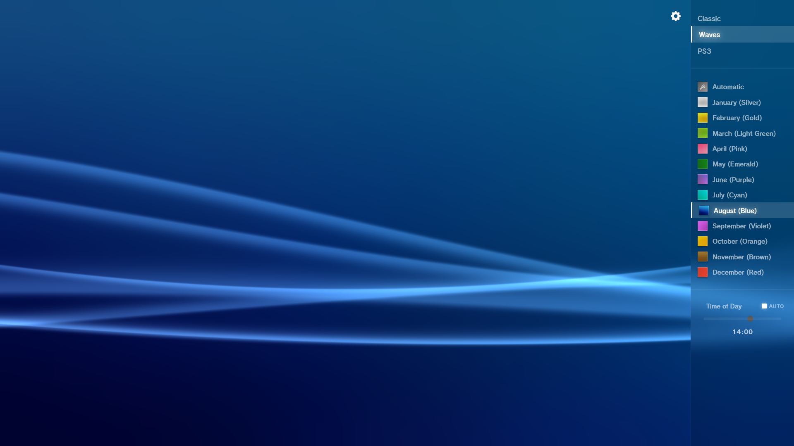

# XMB Waves

This project recreates the background wave animation from the PSP and PS3 XMB interface. It uses HTML, JavaScript, and WebGL to render real-time, procedural waves that mimic the original console menus.

The application features multiple wave styles, including the classic PSP ribbons and the PS3 particles, along with a dynamic color system that changes based on the month or user selection.

## How It Works
The rendering pipeline is designed to replicate the original console's behavior as closely as possible:

* **Background Gradients:** Instead of using CSS gradients or math, the background is generated by sampling **tiny 64x32 pixel textures**. These are stretched across the screen using linear filtering to create the specific, non-linear gradients found on the original hardware.
* **Day/Night Cycle:** The system loads two textures for the current month (Day & Night) and blends them based on the user's local time.
* **Brightness Curve:** A 24-hour brightness table modulates the scene intensity, dimming the screen late at night and brightening it at noon.
* **Color Filters:** A global RGB tint is applied to the scene to match the official monthly colors documented on the [PS3 Developer Wiki](https://www.psdevwiki.com/ps3/Template:XMB_colors).

## Credits
This project uses code and techniques derived from the following sources:

* **PS3 Menu Effect** by int_45h: https://www.shadertoy.com/view/tXy3DK
* **PSP XMB** by cosmicspace777: https://www.shadertoy.com/view/tft3WB
* **PS3 XMB** by sharads: https://www.shadertoy.com/view/7slcWj
* **XMB Wave Background** by fchavonet: https://github.com/fchavonet/creative_coding-xmb_wave_background